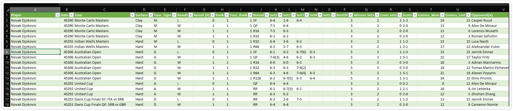
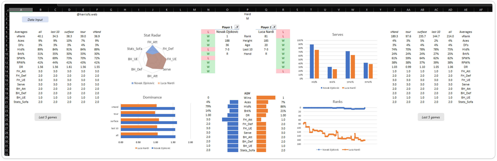
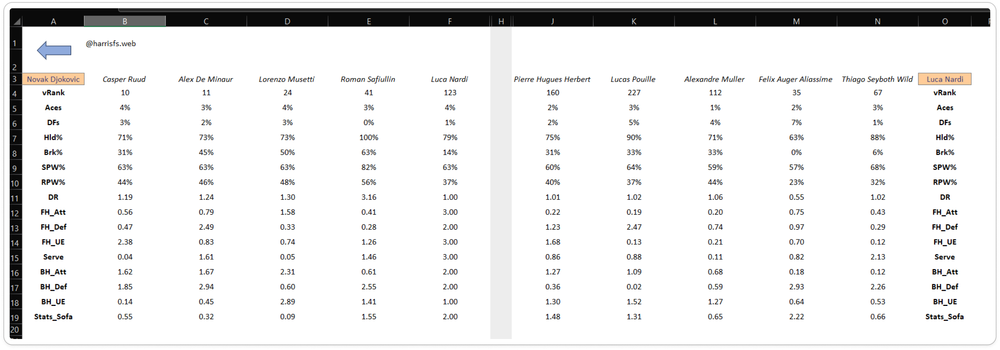

# Data Gathering, Transformation, and Analysis Using Excel

The queries have been decoupled from the Excel file since the data source is not mentioned in this repository. The purpose is to demonstrate separately the functionality of gathering data through web scraping, transforming the data using queries and Excel formulas, and creating a dashboard for analysis of the results.

## Why Excel?

Although the same process could be carried out more easily using Power BI—where Power Query has more capabilities and data visualization is easier and more powerful—the goal was to **create a tool that can be used by anyone with an Excel license and does not require a Power BI account**.

## Challenges with Excel's Power Query

One of the obstacles of using Excel's Power Query is the inability to read some web content as tables. However, this can be bypassed by extracting the data through the HTML code, which requires additional steps.

## Demonstration and Resources

Snippets of the queries are included for demonstration purposes, as well as screenshots of the final dashboard and the UI.

### Screenshots

Here are some screenshots showcasing the final dashboard and user interface:

## Note on File Inclusion

**The decision to not include the `.xlsm` file is due to the significant work put behind it, the valuable calculations and queries included, and to avoid sharing macro-enabled workbooks which can be considered harmful for Windows environments.**

## Summary

This project demonstrates how Excel can be used for data gathering, transformation, and visualization without the need for additional software like Power BI. By leveraging web scraping and advanced Excel functions, it is possible to create comprehensive dashboards accessible to anyone with an Excel license.
